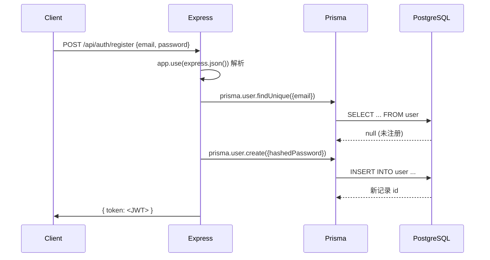

````markdown
# Node.js + Prisma + PostgreSQL 用户注册/登录完整调试指南

> 本文把之前聊天中提到的所有排查步骤、命令与注意事项**一次性**整理成 MarkDown，直接复制即可放进你的 `README.md / docs/`。  
> 开发环境：Node 18 / Express / Prisma Client 4.x / PostgreSQL 17 / pgAdmin 7 / Postman 10。

---

## 目录

1. [错误概览与成因](#1-错误概览与成因)
2. [正确发送注册请求（Postman 设置）](#2-正确发送注册请求postman-设置)
3. [Express 端解析 JSON](#3-express-端解析-json)
4. [Prisma `P2021`：表不存在的终极解决方案](#4-prisma-p2021表不存在的终极解决方案)
    - 4.1 检查 `schema.prisma`
    - 4.2 执行迁移 vs `db push`
    - 4.3 路径写法与常见坑
5. [pgAdmin / psql / Prisma Studio 查看数据](#5-pgadmin--psql--prisma-studio查看数据)
6. [注册接口数据落库流程](#6-注册接口数据落库流程)
7. [FAQ 快速定位表为空/连接串错误](#7-faq快速定位表为空连接串错误)

---

## 环境变量

在 `backend/.env` 中配置以下变量：

- `DATABASE_URL`：PostgreSQL 连接串
- `JWT_SECRET`：签发 JWT 的密钥
- `JWT_SESSION_DURATION`：JWT 有效时间
- `CORS_ORIGIN`：允许的跨域来源，如 `http://localhost:5173`

---

## 1. 错误概览与成因

| 错误代码/现象 | 根本原因 | 触发位置 |
|---------------|----------|----------|
| `400 Bad Request` &nbsp;`"邮箱和密码为必填项"` | `req.body` 为空对象 | Postman `Content-Type` 发成 `text/plain`，Express 默认不解析 |
| `P2021: Table \`public.User\` does not exist` | 数据库没这张表 | Prisma 读取时 `user.findUnique()` |
| CLI 提示 `Provided --schema ./backend/prisma/schema.prisma doesn't exist` | 执行目录与 `--schema` 路径不符 | `npx prisma db push` |

---

## 2. 正确发送注册请求（Postman 设置）

1. **Method**: `POST`
2. **URL**: `http://<ip>:3000/api/auth/register`
3. **Body** → 选择 **raw**，右侧下拉改成 **JSON**
4. 粘贴有效 JSON：
   ```json
   {
     "email": "test@example.com",
     "password": "foobar123"
   }
````

5. **Headers** 会自动带上 `Content-Type: application/json`
6. 点击 **Send**，若后端一切正常将返回：

   ```json
   { "token": "eyJhbGciOiJIUzI..." }
   ```

---

## 3. Express 端解析 JSON

确保在入口文件（如 `app.js`）最顶部就注册中间件：

```js
const express = require('express');
const app = express();

app.use(express.json());                          // 解析 application/json
app.use(express.urlencoded({ extended: true }));  // 如需解析 x-www-form-urlencoded
```

---

## 4. Prisma `P2021`：表不存在的终极解决方案

> **一句话**：先写好 `schema.prisma` ⟶ **执行迁移或推送** ⟶ 确认表在数据库里。

### 4.1 检查 `schema.prisma`

```prisma
datasource db {
  provider = "postgresql"
  url      = env("DATABASE_URL")
}

generator client {
  provider = "prisma-client-js"
}

model User {
  id        Int      @id @default(autoincrement())
  email     String   @unique
  password  String   
  createdAt DateTime @default(now())
}
```

* 想用全小写表名：

  ```prisma
  @@map("user")
  ```

### 4.2 执行迁移 vs `db push`

| 场景             | 命令                                   | 说明                    |
|----------------|--------------------------------------|-----------------------|
| **开发/需要版本化迁移** | `npx prisma migrate dev --name init` | 会生成 `migrations/` 并建表 |
| **快速同步，不关心历史** | `npx prisma db push`                 | 直接把 schema 推到库        |

> ☑️ 成功后终端会输出类似 `The database is now in sync with the Prisma schema.`

### 4.3 路径写法与常见坑

| 你当前 `cwd`               | 正确命令示例                                                       |
|-------------------------|--------------------------------------------------------------|
| `monorepo-todo/backend` | `npx prisma db push --schema ./prisma/schema.prisma`         |
| `monorepo-todo` (根)     | `npx prisma db push --schema ./backend/prisma/schema.prisma` |

* Windows PowerShell 路径带空格需用 `"` 引住。
* `.env` 中的 `DATABASE_URL` 必须指向你想同步的那一库！

---

## 5. pgAdmin / psql / Prisma Studio 查看数据

### 5.1 pgAdmin 图形界面

```
todo_database
 └─ Schemas
     └─ public
         └─ Tables
             ├─ user              ← 注册信息
             └─ _prisma_migrations
```

* 右键 **View/Edit Data → All Rows** 即可查看。

### 5.2 psql CLI

```bash
psql -U postgres -d todo_database
\dt            -- 列出表
SELECT * FROM "user";
```

### 5.3 Prisma Studio

```bash
npx prisma studio --schema ./prisma/schema.prisma
```

浏览器打开后点击 **User** 表格即可。

---

## 6. 注册接口数据落库流程



---

## 7. FAQ 快速定位表为空/连接串错误

| 现象                         | 解决思路                                                  |
|----------------------------|-------------------------------------------------------|
| **pgAdmin 里没有 `user` 表**   | 迁移/`db push` 没成功 → 重新跑；确认 `DATABASE_URL` 指到同一库        |
| **`User` ↔ `user` 大小写不一致** | Postgres 会给带大写的表名加引号 → schema 里 `@@map("user")` 改成全小写 |
| **注册一直 400/500**           | 先 `console.log(req.body) / console.error(err)`，再查错误信息 |
| **P2021 依旧报**              | 1) 库里真没表；2) 连接的是错库；3) 查询了错误 schema                    |

---

### 🎉 现在，你可以：

1. `pnpm dev`（或 `npm run dev` / `yarn dev`）启动后端
2. Postman 正确设置 `JSON` body
3. 观察 pgAdmin / Prisma Studio 中 `user` 表自动新增的数据

一切顺利的话，完整的注册-登录流程就畅通无阻了 🚀

```
```
